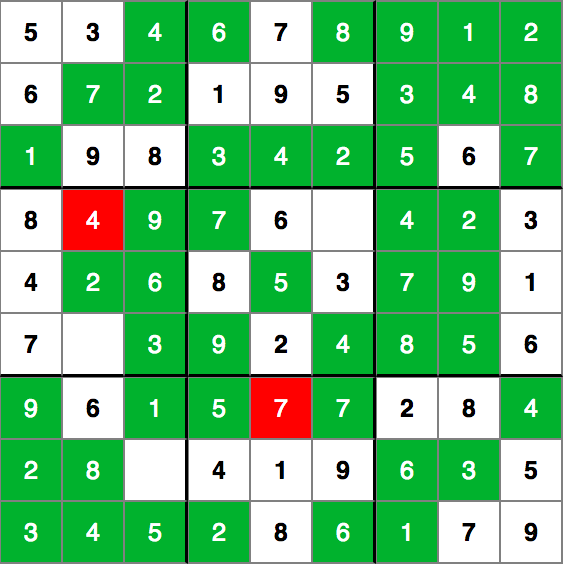

# Sudoku
This online of Sudoku is built entirely in HTML, CSS, and JavaScript without the use of any additional frameworks. Players can check their progress at any time, and the board will visually indicate which of their inputs are incorrect and which are incorrect. The user can also choose to reveal the board and reset the board to its original state. 

## Technologies Used
- Babel 
- CSS3 
- HTML5
- JavaScript
- Webpack 

## Structure
### Board Class 
In order to separate concerns and remain modular, a Board class governs the logic of methods--such as `setupBoard(unsolvedBoard)`, `checkProgress()`, and `solve()`--requiring multiple tiles. 
```javascript 
    setupBoard(unsolvedBoard) {
        // clear previous board, if any
        const board = document.querySelector('.board');
        board.innerHTML = '';

        unsolvedBoard.forEach((num, idx) => {
            populateTile(num, idx);
        });
    }
```

### Tiles
The data for each tile lives almost exclusively on the DOM node. By passing each tile number and index to `populateTile(num, idx)`, the column, row, and 3x3 subgrid can be calculated and added as a data attribute. 
```javascript
function populateTile(num, idx) {
    const boardDiv = document.querySelector('.board');
    const tileDiv = document.createElement('div')
    tileDiv.className = 'tile-div';
    
    let tile;
    if (num === 0) {
        tile = document.createElement('input');
        tile.className = 'tile input';
    } else {
        tile = document.createElement('span');
        tile.textContent = num;
        tile.className = 'tile span';
    }

    // add index, column, and row as data attributes 
    const col = idx % 9;
    const row = Math.floor(idx / 9);
    tile.dataset.index = idx;
    tile.dataset.column = col;
    tile.dataset.row = row;
    tile.dataset.subGrid = determineSubgrid(col, row);

    boardDiv.appendChild(tileDiv);
    tileDiv.appendChild(tile); 

    tile.addEventListener('input', validateInput);
}
```

The storage of data in the DOM, combined with the addition of CSS selectors through JavaScript, allow users to visually gauge their progress on a board.
<br>
 

## Styling
The responsive styling on the board relies on the addition and removal of classes enabled through event listeners in JavaScript. 
```css
.tile {
    font-size: 25px;
}

.tile.input {
    text-align: center;
    width: 90%;
    height: 90%;

    color: dodgerblue;
    caret-color: black;
}

.tile.span {
    font-weight: bold; 
}

.tile-div {
    width: 60px;
    height: 60px;
    border: 1px solid gray;

    display: flex;
    justify-content: center;
    align-items: center; 
}

.tile-div.correct {
    background: rgb(40, 168, 40);
}

.tile-div.correct > input {
    color: white;
}

.tile-div.incorrect {
    background: red;
}

.tile-div.incorrect > input {
    color: white;
}
```

## Next Steps
* **Random Board Generator:** 

* **Live Hints:** The validation logic used above could be utilized to enable live hints. While the user would not be shown if the correct value for a tile has been filled, the user can be informed if the tile conflicts with another in its column, row, or subgrid.

* **Timed Games:** After the implementation of a board generator, 